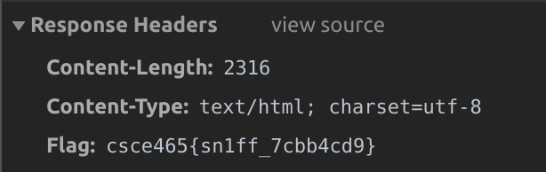

# Homework 1
> User: `vohtarak`
## PRNG
### Solution
Ran `exploit` in the background and `vuln` at the same time, wrote the seeded results to `numbers.txt`

### Code
```cpp
#include <stdlib.h>
#include <stdio.h>
#include <string.h>
#include <limits.h>
#include <time.h>
#include <unistd.h>

#define FLAGSIZE 128

void win() {
  char buf[FLAGSIZE];
  FILE *f = fopen("flag.txt","r");
  fgets(buf,FLAGSIZE,f);
  puts(buf);
  fflush(stdout);
}

int main(int argc, char *argv[])
{
   srand(time(NULL));

   FILE *numbers = fopen("/home/vohtarak/homework-1/numbers.txt","w");
   for(int i = 0; i < 10; i++)
      fprintf(numbers, "%i: %li\n", i, random()%100);
   fclose(numbers);

   return 0;
}
```

### Help Received
- https://linux.die.net/man/3/fopen
- https://www.maketecheasier.com/run-bash-commands-background-linux/
- http://ctfweb.martincarlisle.com/problems

---

## Websniff
### Solution
1. Loaded the webpage
2. Opened Chrome Dev Tools to the `Network` tab
3. Reloaded to monitor network traffic
4. Looked at the main load request headers


### Help Received
- Chrome dev tools

---

## Brute Force Password
### Solution
run `john --wordlist=/usr/share/dict/words saltedpasswd.txt` and wait to output the password
### Help Received
https://www.openwall.com/john/doc/

---

## Known plaintext RSA
### Solution
Running my python script in the directory of `messages.txt` will write the text to the file `hacked.txt`

For each encrypted message, I create a string, pad it with null bytes, pass it through `openssl rsault` encrypting with the respective public key, encode it in `base64`, and compare the result to the encrypted message.

### Code
```python
import os
import subprocess
from subprocess import PIPE

from itertools import islice


def getFilePath(filename):
    currentDirectory = os.path.dirname(os.path.realpath(__file__))
    return currentDirectory + '/' + filename

def openFile(filename, mode):
    return open(getFilePath(filename), mode)

PRES_KEY = getFilePath('presidentpub.pem')
TRES_KEY = getFilePath('treasurypub.pem')

def getEncrypted(text, key):
    # Pad with null bytes
    text = text.ljust(256, chr(0))

    # use openssl rsautl
    rsa_result = subprocess.run(['openssl', 'rsautl', '-encrypt', '-raw', '-pubin', '-inkey', key], input=text.encode('utf-8'), stdout=PIPE).stdout

    # use base64 encode
    base_result = subprocess.run(['openssl', 'base64', '-A'], input=rsa_result, stdout=PIPE).stdout

    return base_result.decode('utf-8')

banks = openFile("banks.txt", "r").readlines()
hacked = openFile('hacked.txt', 'w')

with openFile("messages.txt", "r") as messagesFile:
    while True:
        message = list(islice(messagesFile, 5))
        if message is None: 
            exit()
        
        message = [m.strip() for m in message]
        message = "".join(message)

        crackedText = None
        test = openFile('test.txt', 'w')
        for bank in banks:
            bank = bank.strip()
            encrypt = getEncrypted('How much to ' + bank + '?\n', PRES_KEY)
            test.write(encrypt)
            if message == encrypt:
                crackedText = bank
                break

        if crackedText is None:
            for i in range(1, 999):
                encrypt = getEncrypted('$' + str(i) + 'B\n', TRES_KEY)
                if message == encrypt:
                    crackedText = str(i)
                    break
        
        if crackedText is None:
            print('not today son')
        else:
            hacked.write(crackedText + '\n')

banksFile.close()
hacked.close()
```
### Help Received
- Piazza posts
- https://www.mkssoftware.com/docs/man1/openssl_rsautl.1.asp
- https://linux.die.net/man/1/base64
- https://stackoverflow.com/questions/89228/calling-an-external-command-from-python/46815111#46815111