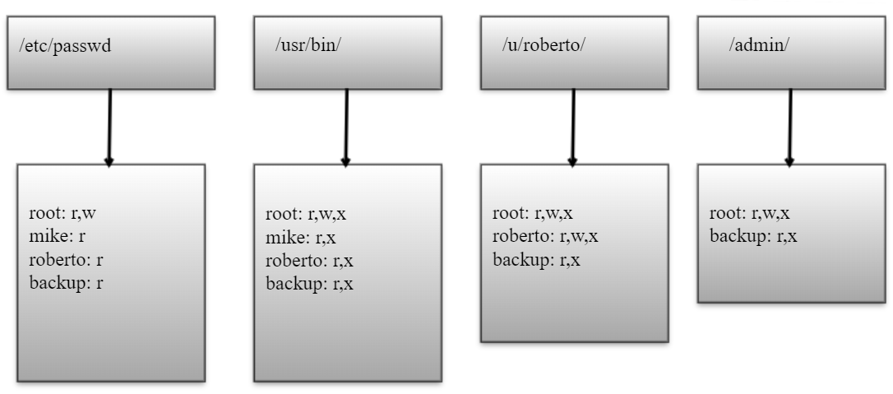

- [Terminology](#terminology)
  - [Confidentiality](#confidentiality)
    - [Encryption](#encryption)
    - [Access Control](#access-control)
    - [Authentication](#authentication)
    - [Authorization](#authorization)
    - [Physical Security](#physical-security)
  - [Integrity](#integrity)
  - [Backup](#backup)
  - [Checksum](#checksum)
  - [Data Correcting Code](#data-correcting-code)
  - [Availability](#availability)
    - [Physical Protections](#physical-protections)
    - [Computational Redundancies](#computational-redundancies)
  - [Assurance](#assurance)
    - [Policies](#policies)
    - [Permissions](#permissions)
    - [Protections](#protections)
  - [Authenticity](#authenticity)
    - [Digital Signature](#digital-signature)
    - [Nonrepudiation](#nonrepudiation)
  - [Anonymity](#anonymity)
    - [Aggregation](#aggregation)
    - [Mixing](#mixing)
    - [Proxies](#proxies)
    - [Pseudonyms](#pseudonyms)
  - [Correlation and Traceback](#correlation-and-traceback)
  - [Social Engineering](#social-engineering)
  - [Virus](#virus)
  - [Worm](#worm)
  - [Rootkit](#rootkit)
  - [Trojan](#trojan)
  - [Insider Attack](#insider-attack)
  - [Backdoor](#backdoor)
  - [Easter Egg](#easter-egg)
  - [Logic Bomb](#logic-bomb)
  - [Polymorphic Virus](#polymorphic-virus)
  - [Metamorphic Virus](#metamorphic-virus)
  - [Zombie](#zombie)
  - [Botnet](#botnet)
- [Security Principles](#security-principles)
  - [Economy of mechanism](#economy-of-mechanism)
  - [Fail-safe defaults](#fail-safe-defaults)
  - [Complete Mediation](#complete-mediation)
  - [Open Design](#open-design)
  - [Separation of Privilege](#separation-of-privilege)
  - [Least Privilege](#least-privilege)
  - [Least Common Mechanism](#least-common-mechanism)
  - [Psychological Acceptability](#psychological-acceptability)
  - [Work Factor](#work-factor)
  - [Compromise Recording](#compromise-recording)
- [Attacks](#attacks)
  - [Alteration](#alteration)
  - [Denial of Service](#denial-of-service)
  - [Masquerading](#masquerading)
  - [Format String](#format-string)
  - [Chosen Plaintext](#chosen-plaintext)
  - [Eavesdropping](#eavesdropping)
  - [Repudiation](#repudiation)
- [Passwords](#passwords)
  - [Brute Force Attack](#brute-force-attack)
  - [Salting](#salting)
  - [Purpose of BIOS password](#purpose-of-bios-password)
- [Message Authentication Code (MAC)](#message-authentication-code-mac)
- [Hibernation File Vulnerabilities](#hibernation-file-vulnerabilities)
- [Stack Buffer Overflow](#stack-buffer-overflow)
  - [Stack Canary](#stack-canary)
  - [Address Space Layout Randomization](#address-space-layout-randomization)
  - [Non-executable Stack](#non-executable-stack)
  - [ROP](#rop)
  - [Return to Libc](#return-to-libc)
- [Access Control](#access-control-1)
  - [Matrix](#matrix)
  - [List](#list)
  - [Linux v Windows](#linux-v-windows)
    - [File organization](#file-organization)
    - [Access Control Entries](#access-control-entries)
  - [Linux Permissions](#linux-permissions)
- [Linux Sticky bit](#linux-sticky-bit)
- [Windows File Copy Permissions](#windows-file-copy-permissions)
- [Global Offset Table / Library Routines](#global-offset-table--library-routines)
- [Integer Overflow / 2's Complement](#integer-overflow--2s-complement)
- [Ciphers](#ciphers)
  - [Caesar](#caesar)
  - [Substitution](#substitution)
  - [Vignere](#vignere)
  - [Block](#block)
    - [DES](#des)
    - [3DES](#3des)
    - [AES](#aes)
- [One-time Pad](#one-time-pad)
  - [Perfect Security](#perfect-security)
  - [Reuse is Vulnerable](#reuse-is-vulnerable)
- [ECB Encryption](#ecb-encryption)
- [CBC Mode](#cbc-mode)
- [OFB / CTF Encryption](#ofb--ctf-encryption)
  - [Strengths](#strengths)
  - [Weaknesses](#weaknesses)
- [Diffie-Helman-Merkle Key Exchange](#diffie-helman-merkle-key-exchange)
- [RSA](#rsa)
  - [Implement with small primes](#implement-with-small-primes)
  - [How to select for encryption and signing](#how-to-select-for-encryption-and-signing)
- [Euler's Theorem](#eulers-theorem)
- [Anti-Virus](#anti-virus)

# Terminology
## Confidentiality
> Avoidance of unauthorized disclosure of information

### Encryption
> Transformation of information using a secret (*encryption key*) so that the transformed information can only be read using another secret (*decryption key*)

### Access Control
> Rules and policies that limit access to confidential information to those people and/or systems with a 'need to know'

### Authentication
> The determination of the identity or role that someone has (typically based on keys, passwords, or a fingerprint)

### Authorization
> The determination if a person or system is allowed access to resources based on an [access control policy](#access-control-1)

### Physical Security
> The establishment of physical barriers to limit access to protected computational resources

---

## Integrity
> The property that information has to not be altered in an unauthorized way

## Backup
> Periodic archiving of data

## Checksum
> The computation of a function that maps the contents of a file to a numerical value.

## Data Correcting Code
> Methods for storing data in such a way that small changes cna be easily detected and automatically corrected

---

## Availability
> The property that information is accessible and modifiable in a timely fashion by those authorized to do so.

### Physical Protections
> Infrastructure meant to keep information available even in the event of physical challenges

### Computational Redundancies
> Computers and storage devices that serve as fallbacks in the case of failures

---

## Assurance
> How trust is provided and managed in computer systems

### Policies
> Specify behavioral expectations that people or systems have for themselves and others

### Permissions
> Describe the behaviors that are allowed by the agents that interact with a person or system

### Protections
> Mechanisms to enforce policies and procedures

---

## Authenticity
> The ability to determine that statements, policies, and permissions issued by persons or systems are genuine

### Digital Signature
> Cryptographic computations that allow a person or system to commit to the authenticity of their documents in a unique way that achieves [nonrepudiation](#nonrepudiation)

### Nonrepudiation
> The property that authentic statements issued by some person or system cannot be denied

---

## Anonymity
> Property that certain records or transactions are not to be attributable to any individual

### Aggregation
> Combining of data from many individuals so that disclosed sums or averages cannot be tied to any individual

### Mixing
> Intertwining of transactions, information, or communications in a way that cannot be traced to any individual

### Proxies
> Trusted agents that are willing to engage in actions for an individual in a way that cannot be traced back to a person

### Pseudonyms
> Fictional identities that can fill in for real identities in communications and transactions, but are otherwise known only to a trusted entity

---

## Correlation and Traceback
> The integration of multiple data sources and information flows to determine the source of a particular data stream or piece of information

## Social Engineering
> 

## Virus
> 

## Worm
> 

## Rootkit
> 

## Trojan
> 

## Insider Attack
> 

## Backdoor
> 

## Easter Egg
> 

## Logic Bomb
> 

## Polymorphic Virus
> 

## Metamorphic Virus
> 

## Zombie
> 

## Botnet
> 

# Security Principles
## Economy of mechanism 
> Stresses `simplicity` in the design and implementation of security measures

## Fail-safe defaults
> Default configuration of systems should have a conservative protection scheme

## Complete Mediation
> Every access to a resource must be checked for compliance with a protection scheme

## Open Design
> Security architecture and design should be made publicly available

## Separation of Privilege
> Multiple conditions should be required to achieve access to restricted resources or have a program perform some action

## Least Privilege
> Each program / user should operate with the minimum privileges necessary to function properly

## Least Common Mechanism
> Resources shared between users should be minimized

## Psychological Acceptability
> Interfaces should be well designed and intuitive

## Work Factor
> Cost of circumventing a security mechanism should be weighed against the resources of an attacker

## Compromise Recording
> Record details of intrusion

---

# Attacks
## Alteration
> Network stream is intercepted, modified, and retransmitted (*Man in the middle*)

## Denial of Service
> Interruption or degradation of a data service or information access (*spam*)

## Masquerading
> The fabrication of information that is purported to be from someone who is not actually the author

## Format String
> Get pointers via format string, like `$4%x`

## Chosen Plaintext
> 

## Eavesdropping
> The interception of information intended for someone else during its transmission over a communication channel

## Repudiation
> Denial of a commitment or data receipt

---

# Passwords
## Brute Force Attack
> Dictionary attack, start from common words and known passwords

## Salting
> Associate random number with user id, then hash with password. Only possible leak for one password

## Purpose of BIOS password
> Does not allow a second-stage bootloader to be executed without proper authentication

# Message Authentication Code (MAC)
> 

# Hibernation File Vulnerabilities
> Could look at hibernation files to find passwords that were still in memory when user put computer into hibernation

# Stack Buffer Overflow
## Stack Canary
> Canary gets stuck in stack, if canary is modified, code will stop executing

## Address Space Layout Randomization
> 

## Non-executable Stack
> 

## ROP
> 

## Return to Libc
> 

# Access Control
## Matrix
|         | /etc/password | /usr/bin        | /u/roberto      | /admin          |
|---------|---------------|-----------------|-----------------|-----------------|
| root    | read,write    | read,write,exec | read,write,exec | read,write,exec |
| mike    | read          | read,exec       |                 |                 |
| roberto | read          | read,exec       | read,write,exec |                 |
| backup  | read          | read,exec       | read,exec       | read,exec       |

## List

## Linux v Windows
### File organization
- Tree (*Windows*)
- DAG (*Linux*)

### Access Control Entries
- Allow-only (*Linux*)
- Allow and deny (*Windows*)

## Linux Permissions
> File-permission matrix
> 
> Files have owner permissions, group permissions, and world permissions
> 
> Ex: `-rwxrwxrwx`

# Linux Sticky bit

# Windows File Copy Permissions

# Global Offset Table / Library Routines
A table of addresses stored in the data section

Allows for position-independent code for shared libraries

# Integer Overflow / 2's Complement
Integers wrap around

Can be a different number if compiler chooses int as signed or not

# Ciphers
## Caesar
> Rotation, attack by rotating 26 times

## Substitution
> Pure substitution, attack frequency analysis

## Vignere
> Rotate by different shifts per character, attack frequency analysis

## Block
> 

### DES
> 

### 3DES
> 

### AES
> 

# One-time Pad
## Perfect Security
> 

## Reuse is Vulnerable
> 

# ECB Encryption

# CBC Mode

# OFB / CTF Encryption
## Strengths
> 

## Weaknesses
> 

# Diffie-Helman-Merkle Key Exchange

# RSA
## Implement with small primes
> 

## How to select for encryption and signing
> 

# Euler's Theorem

# Anti-Virus